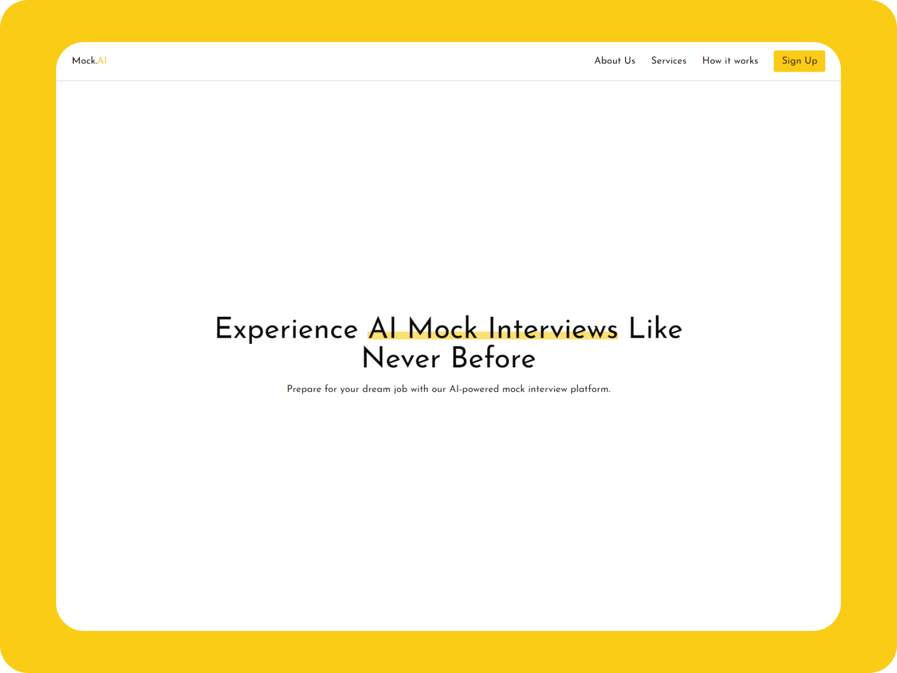
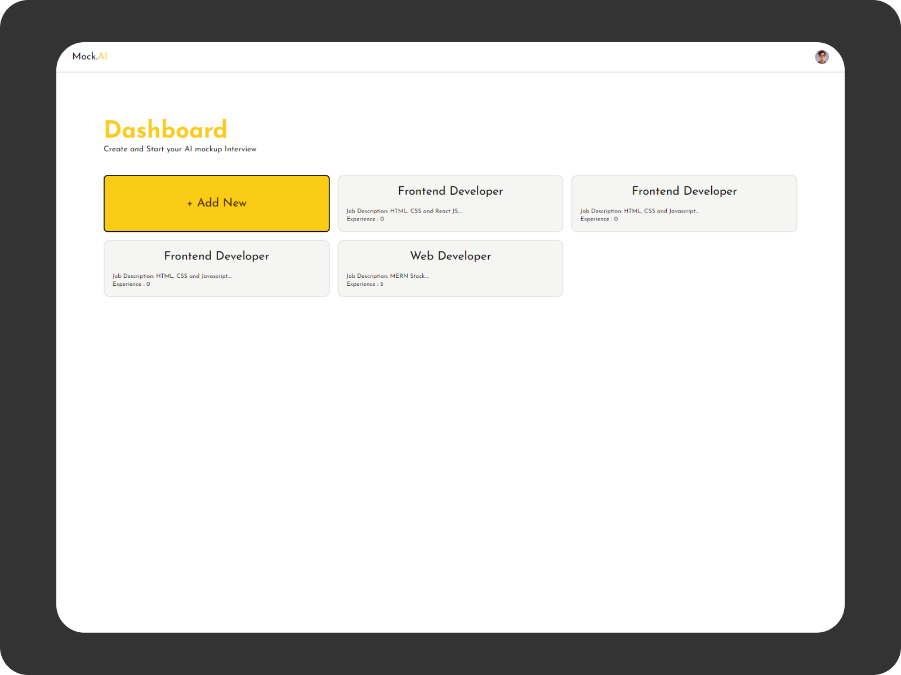
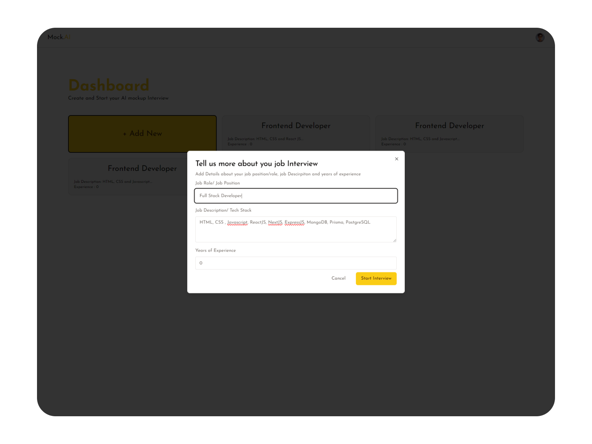
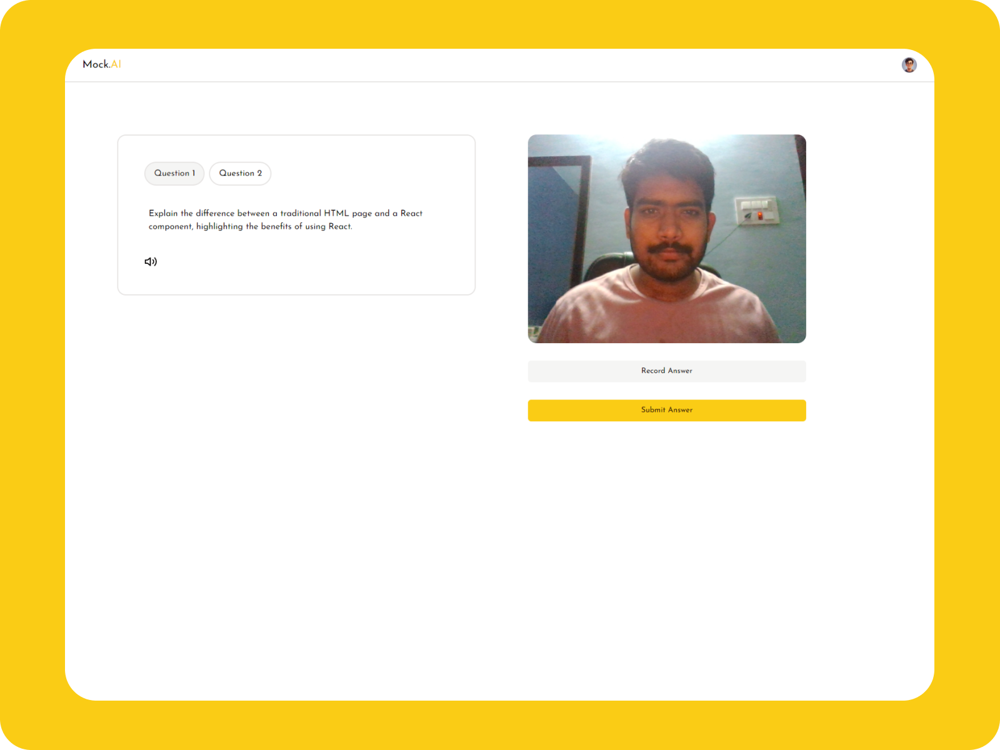
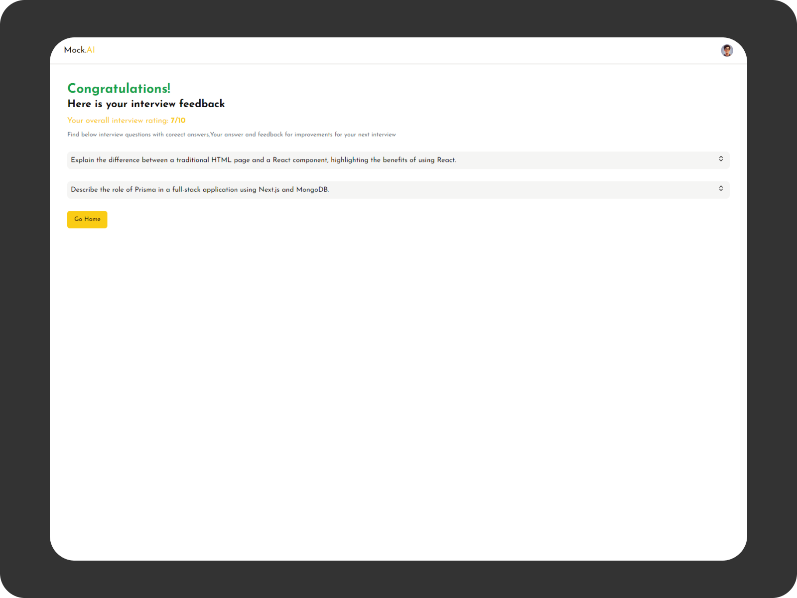

#  Mock-AI: AI-Based Interview Practice Application

Welcome to Mock-AI! This project is a Next.js application designed to provide a seamless AI-based interview practice experience for users. The application is built with modern web technologies, including Next.js, React.js, Tailwind CSS, Shadcn UI, and Gemini API, and features robust authentication and user management with Clerk.

## Features

- **User Authentication** : Secure login with Clerk for easy account management.
- **AI-Based Interview Practice** : Engage in mock interviews powered by advanced AI, tailored to your desired job roles.
- **Real-time Feedback** : Receive instant feedback and suggestions on your responses to help you improve.
- **Personalized Practice** : Customize your practice sessions based on the job role, skill set, and difficulty level.
- **Profile Section** : Manage your profile details and view personalized recommendations.
- **Progress Tracking** : View your performance history and track your progress over time.
- **Question Bank** : Access a vast question bank categorized by job roles and skills.


## Tech Stack


## Environment Variables

To run this project, you will need to add the following environment variables to your .env file

```
NEXT_PUBLIC_CLERK_PUBLISHABLE_KEY=""
CLERK_SECRET_KEY=""
NEXT_PUBLIC_CLERK_SIGN_IN_URL=/sign-in
NEXT_PUBLIC_CLERK_SIGN_UP_URL=/sign-up
NEXT_PUBLIC_GEMINI_API_KEY=""
NEXT_PUBLIC_INTERVIEW_QUESTION_COUNT=2
DATABASE_URL=""
```
## Run Locally

Clone the project

```bash
  git clone  https://github.com/sakethrambilla/mock-ai.git
```

Go to the project directory


```bash
  cd mock-ai
```

Install dependencies

```bash
  npm install
```

Start the server

```bash
  npm run dev
```


## Deployment

Project is deployed at:  https://mock-ai-gemini.vercel.app/


## Screenshots








